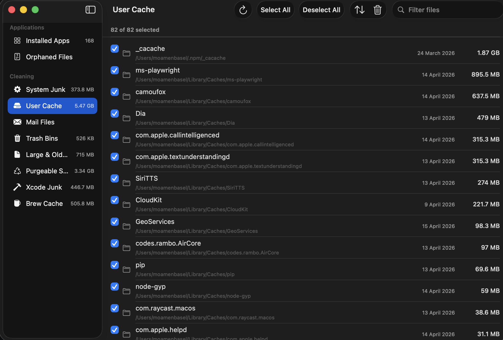

<p align="center">
  
</p>

<p align="center">
  <a href="../README.md">English</a> |
  <b>العربية</b> |
  <a href="README.es.md">Español</a> |
  <a href="README.ja.md">日本語</a> |
  <a href="README.zh-Hans.md">简体中文</a> |
  <a href="README.zh-Hant.md">繁體中文</a>
</p>

<h1 align="center">PureMac</h1>

<p align="center" dir="rtl">
  <b>أداة مجانية ومفتوحة المصدر لإدارة التطبيقات وتنظيف النظام على macOS.</b><br>
  إزالة التطبيقات بالكامل. العثور على الملفات اليتيمة. تنظيف ملفات النظام غير المرغوبة.<br>
  بلا اشتراكات. بلا تتبع. بلا جمع بيانات.
</p>

<p align="center">
  <a href="https://github.com/momenbasel/PureMac/releases/latest"></a>
  <a href="https://github.com/momenbasel/PureMac/actions/workflows/build.yml"></a>
  
  
  <a href="../LICENSE"></a>
  <a href="https://github.com/momenbasel/PureMac/stargazers"></a>
  <a href="https://github.com/momenbasel/PureMac/releases"></a>
</p>

<p align="center">
  <a href="#التثبيت">التثبيت</a> -
  <a href="#الميزات">الميزات</a> -
  <a href="#لقطات-الشاشة">لقطات الشاشة</a> -
  <a href="#المساهمة">المساهمة</a>
</p>

---

<div dir="rtl">

## التثبيت

### Homebrew (موصى به)

```bash
brew update
brew install --cask puremac
```

### التنزيل المباشر

نزّل أحدث ملف `.dmg` من صفحة [Releases](https://github.com/momenbasel/PureMac/releases/latest)، ثم افتحه واسحب PureMac إلى `/Applications`.

> موقّع وموثّق باستخدام Apple Developer ID — يُثبَّت دون ظهور تحذيرات Gatekeeper.

### البناء من الكود المصدري

```bash
brew install xcodegen
git clone https://github.com/momenbasel/PureMac.git
cd PureMac
xcodegen generate
xcodebuild -project PureMac.xcodeproj -scheme PureMac -configuration Release -derivedDataPath build build
open build/Build/Products/Release/PureMac.app
```

## الميزات

### أداة إزالة التطبيقات
- اكتشاف جميع التطبيقات المثبّتة في `/Applications` و `~/Applications`
- محرّك اكتشاف ملفات اعتمادي يقوم على **المطابقة بعشرة مستويات** (مُعرِّف الحزمة، اسم الشركة، الـ entitlements، مُعرِّف الفريق، بيانات Spotlight الوصفية، اكتشاف الحاويات)
- **ثلاث مستويات حساسية**: Strict (آمن) و Enhanced (متوازن) و Deep (شامل)
- عرض جميع الملفات المرتبطة: ذاكرة التخزين المؤقت، والتفضيلات، والحاويات، والسجلات، وملفات الدعم، ووكلاء التشغيل
- حماية تطبيقات النظام — يُستبعَد 27 تطبيقًا من Apple من قائمة الإزالة
- عرض رئيسي/تفصيلي: جدول التطبيقات على اليمين، والملفات المكتشفة على اليسار

### العثور على الملفات اليتيمة
- اكتشاف الملفات المتبقية في `~/Library` من تطبيقات سبق إزالتها
- مقارنة محتوى الـ Library بمُعرِّفات جميع التطبيقات المثبّتة
- تنظيف الملفات اليتيمة بنقرة واحدة

### تنظيف النظام
- **الفحص الذكي** — فحص بنقرة واحدة لجميع الفئات
- **ملفات النظام غير المرغوبة** — ذاكرة التخزين المؤقت للنظام والسجلات والملفات المؤقتة
- **ذاكرة التخزين المؤقت للمستخدم** — اكتشاف ديناميكي لذاكرة التخزين المؤقت لكل التطبيقات (دون قوائم مكتوبة مسبقًا)
- **مرفقات البريد** — مرفقات البريد التي تم تنزيلها
- **سلة المهملات** — تفريغ كل سلال المهملات
- **الملفات الكبيرة والقديمة** — ملفات يزيد حجمها عن 100 ميغابايت أو أقدم من سنة
- **المساحة القابلة للإزالة** — اكتشاف المساحة القابلة للإزالة في APFS
- **ملفات Xcode غير المرغوبة** — DerivedData والأرشيفات وذاكرة التخزين المؤقت للمحاكيات
- **ذاكرة التخزين المؤقت لـ Brew** — ذاكرة تنزيلات Homebrew (مع دعم HOMEBREW_CACHE مخصص)
- **التنظيف المجدوَل** — فحص تلقائي وفق فترات قابلة للتخصيص

### تجربة أصيلة في macOS
- مبنيّ على SwiftUI باستخدام مكوّنات macOS الأصلية
- `NavigationSplitView` و `Toggle` و `ProgressView` و `Form` و `GroupBox` و `Table`
- يتبع المظهر الفاتح/الداكن للنظام تلقائيًا
- دون تدرّجات لونية مخصصة أو أساليب ويب دخيلة
- إعداد تمهيدي عند أول تشغيل يشمل ضبط الوصول الكامل إلى القرص

### الأمان
- تأكيد قبل كل عملية حذف حاسمة
- حماية من هجمات الروابط الرمزية — يتم حل المسارات والتحقق منها قبل الحذف
- حماية تطبيقات النظام — لا يمكن إزالة تطبيقات Apple
- لا يتم تحديد الملفات الكبيرة والقديمة تلقائيًا
- تسجيل منظّم عبر `os.log` (يظهر في تطبيق "وحدة التحكم")

</div>

## لقطات الشاشة

| الإعداد التمهيدي | أداة إزالة التطبيقات |
|---|---|
|  |  |

| ملفات النظام غير المرغوبة | ملفات Xcode غير المرغوبة |
|---|---|
|  |  |

| ذاكرة التخزين المؤقت للمستخدم |
|---|
|  |

<div dir="rtl">

## البنية المعمارية

```
PureMac/
  Logic/Scanning/     - محرّك الفحص الاعتمادي وقاعدة المواقع والشروط
  Logic/Utilities/    - التسجيل المنظّم
  Models/             - نماذج البيانات والأخطاء المُنمّطة
  Services/           - محرّك الفحص ومحرّك التنظيف والمجدوِل
  ViewModels/         - حالة التطبيق المركزية
  Views/              - واجهات SwiftUI الأصلية
    Apps/             - واجهات أداة إزالة التطبيقات
    Cleaning/         - الفحص الذكي وواجهات الفئات
    Orphans/          - أداة الملفات اليتيمة
    Settings/         - إعدادات قائمة على Form الأصلي
    Components/       - مكوّنات مشتركة
```

المكوّنات الأساسية:
- **AppPathFinder** — محرّك مطابقة اعتمادي بعشرة مستويات لاكتشاف ملفات التطبيقات
- **Locations** — أكثر من 120 مسارًا للبحث في نظام ملفات macOS
- **Conditions** — 25 قاعدة مطابقة خاصة بتطبيقات بعينها للحالات الاستثنائية (Xcode وChrome وVS Code وغيرها)
- **AppInfoFetcher** — بيانات Spotlight الوصفية مع اعتماد Info.plist بديلًا لاكتشاف التطبيقات
- **Logger** — تسجيل موحّد عبر `os.log` من Apple

## المساهمة

المساهمات مرحّب بها. راجع [CONTRIBUTING.md](../CONTRIBUTING.md) للاطلاع على الإرشادات.

المجالات التي تحظى بترحيب خاص:
- إعدادات جاهزة لفلاتر الحجم والتاريخ في واجهات الفئات
- تغطية باستخدام XCTest لـ AppState ومحرّك الفحص
- الترجمة إلى لغات إضافية
- تصميم أيقونة التطبيق

## الرخصة

رخصة MIT. راجع [LICENSE](../LICENSE) للتفاصيل.

</div>
