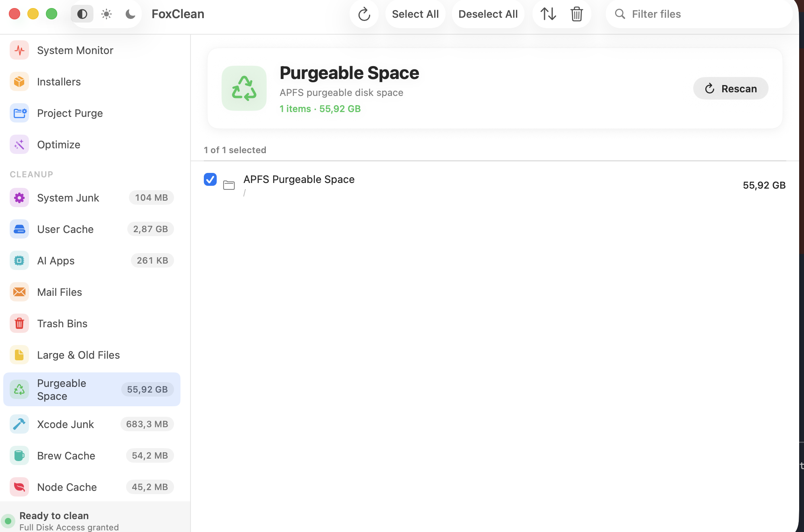
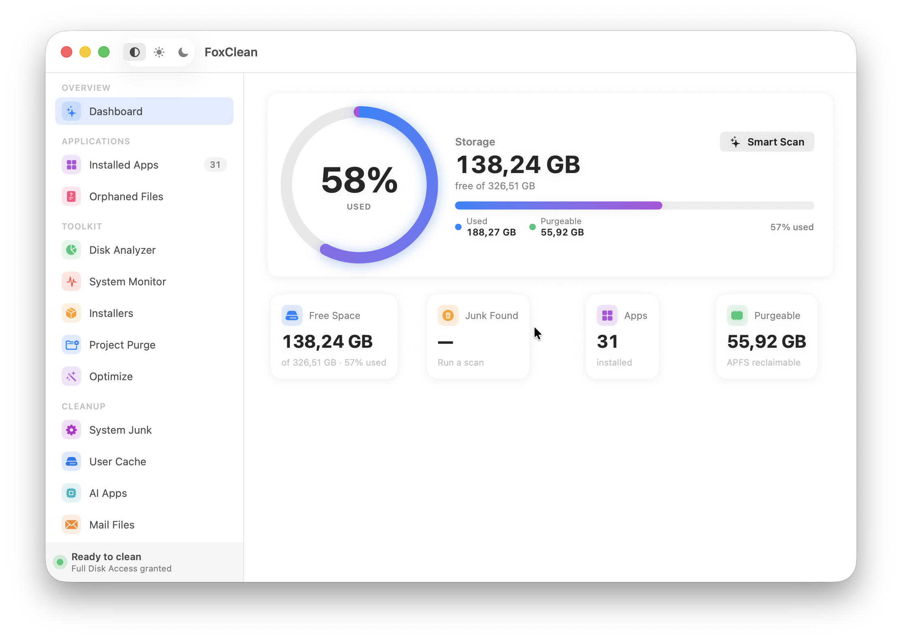
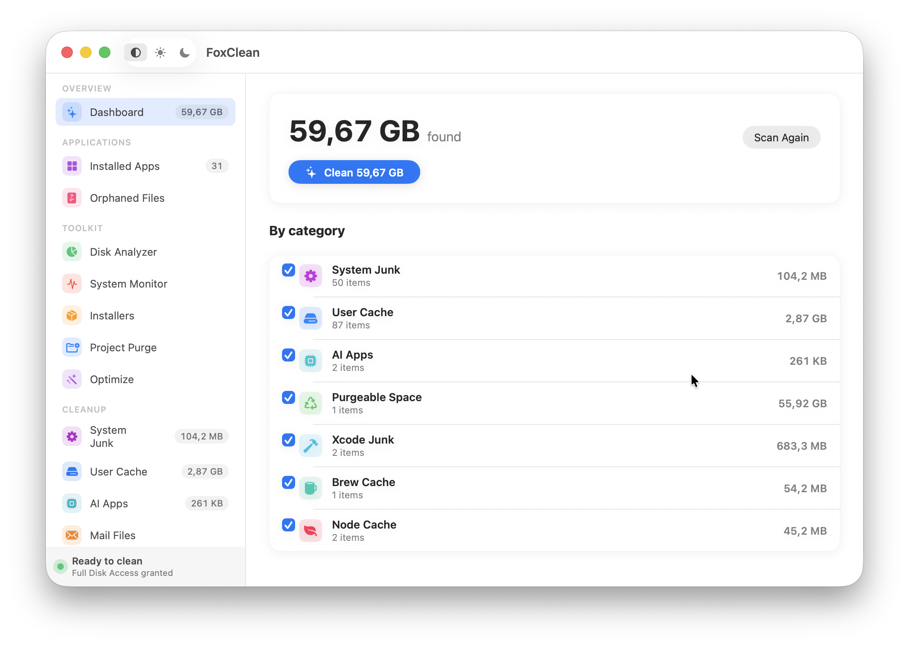
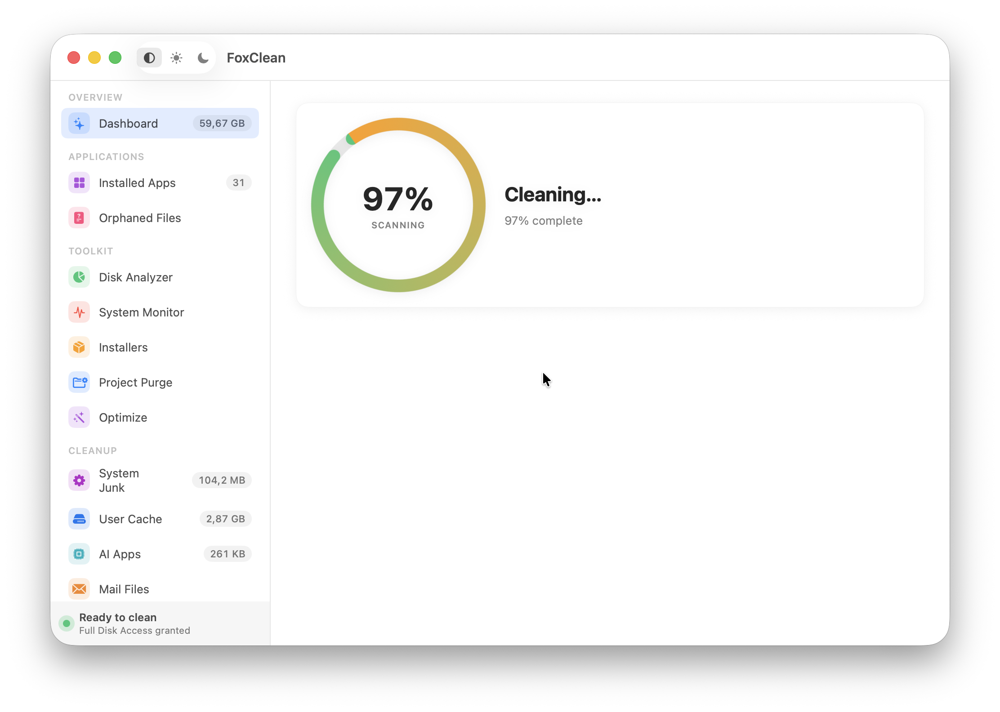

# FoxClean

FoxClean is a powerful, free, and open-source macOS cleaner and optimizer. It combines a beautiful native SwiftUI application with a shared Swift core and the versatile `fox` Command Line Interface (CLI). Designed for users who want complete control over their Mac's performance without telemetry, subscriptions, or hidden fees.


*A sleek, native SwiftUI interface to keep your Mac clean and optimized.*

## 🚀 Key Features

### 🖥️ Native SwiftUI Application
FoxClean comes with a modern, fast, and native macOS application interface based on PureMac.
- **App Scanner**: Quickly find and manage installed applications.
- **Junk Scanner**: Identify and clean up unnecessary files, caches, and logs to free up space.
- **Orphan Detection**: Detect leftover files from previously uninstalled applications.
- **System Status & Disk Analyzer**: Monitor your Mac's health and visualize disk usage in real-time.


*Deep system scanning and junk cleaning in action.*

### 🛠️ Shared `FoxCleanCore`
At its heart, FoxClean uses a robust shared core that ensures consistency between the app and the CLI.
- **Dry-run Cleaning**: See what will be deleted before making any changes.
- **Trash-first Deletion**: Safely move files to the Trash by default, preventing accidental data loss.
- **Operation Logs & Rollback**: Maintains JSONL operation logs, allowing you to rollback changes if needed.
- **Project Purge & Installer Cleanup**: Quickly remove heavy project directories (like `node_modules` or `.build`) and leftover installers.


*Safely completely uninstall applications and their associated data.*

### 💻 Powerful `fox` CLI
For power users and developers, the `fox` CLI offers comprehensive control over your system:
- Available commands: `scan`, `clean`, `uninstall`, `log`, `analyze`, `status`, `purge`, `installer`, `optimize`, `open`, `touchid`, and `completion`.


*Additional options and settings for customized cleaning.*

## 🔒 Safety First

We prioritize your data's safety.
- **Dry-run by default**: All destructive CLI actions default to dry-run mode.
- **Trash moves**: Use the `--confirm` flag to explicitly move items to the Trash.
- **Permanent Deletion**: True permanent deletion requires both `--permanent` and `--confirm-permanent` flags, preventing accidental disasters.

## 🗑️ Uninstalling FoxClean

If you ever need to remove FoxClean from your system, you have two options:

**1. Standard macOS way:**
- Open `Finder` and go to the `Applications` folder.
- Drag `FoxClean.app` to the Trash (or right-click and select "Move to Trash").
- Empty the Trash.

**2. Complete removal via CLI:**
To completely remove FoxClean and all its associated data (caches, preferences, logs, etc.), you can use its own CLI before deleting the app:
```sh
fox uninstall dev.foxclean.app --confirm
```

## 🏗️ Build Instructions

To build the FoxClean app and CLI from source:

```sh
# Install dependencies using Homebrew
brew bundle

# Generate the Xcode project
xcodegen generate

# Build the macOS application
xcodebuild -scheme FoxCleanApp -destination 'platform=macOS' build

# Run Swift tests
swift test

# Verify the CLI tool
swift run fox --version
```

## 📜 License & Privacy

- **No Telemetry**: FoxClean does not track you, collect data, or send any information to remote servers.
- **No Subscription**: 100% free forever.
- **MIT Licensed**: Open source and community-driven. See the [LICENSE](LICENSE) file for more details.

---

*Keep your Mac running like new with FoxClean!*
